# hsa-s3

# Task
Simple Storage

Create bucket where objects can’t be modified and all requests are logged.

# Solution

1. Create bucket
   1. 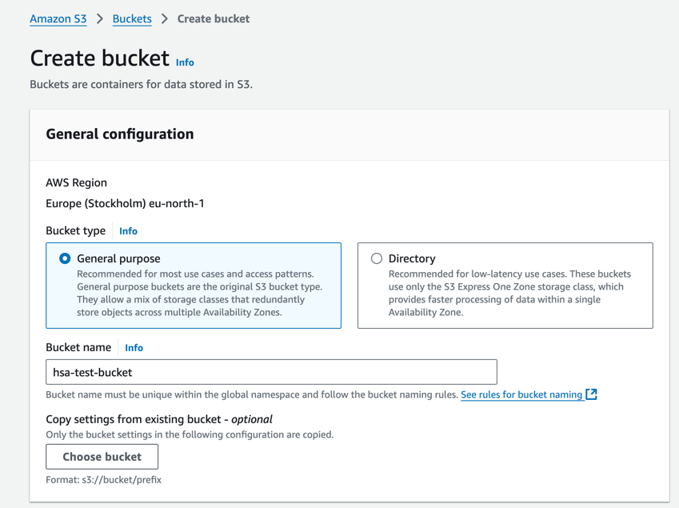
   2. 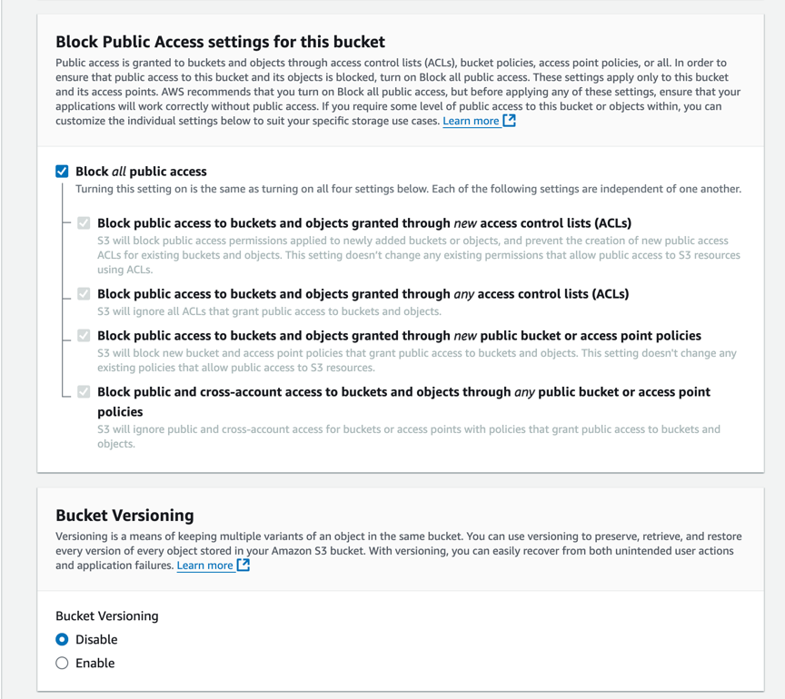
   3. 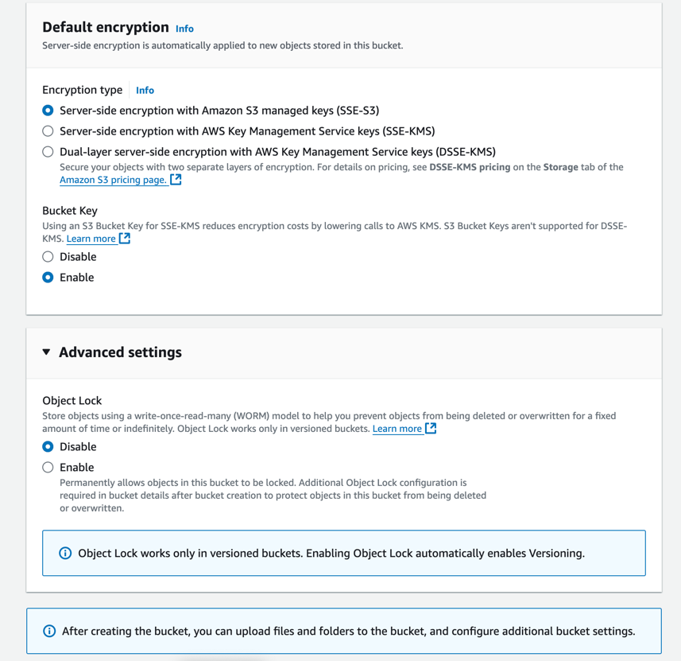
   4. 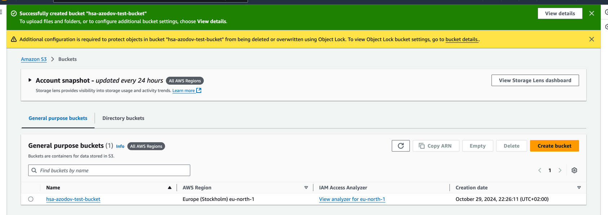
2. Config bucket Object Lock
   1. 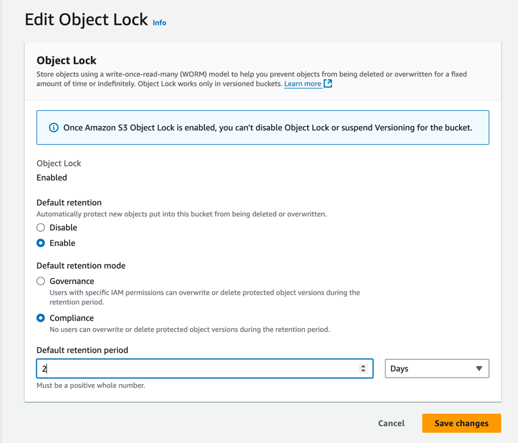
   2. On attempt to upload file with the same name its version created 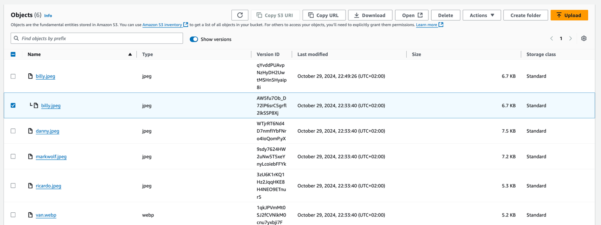
3. (Optional) Config ACL to allow external read access to files
   1. 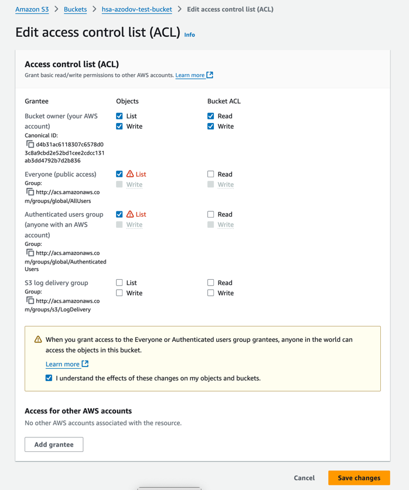
   2. 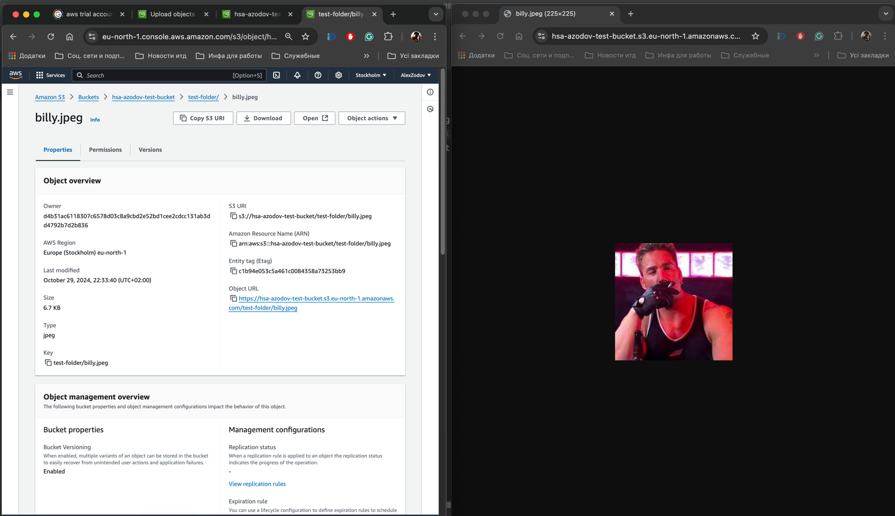
4. Config logging
   1. 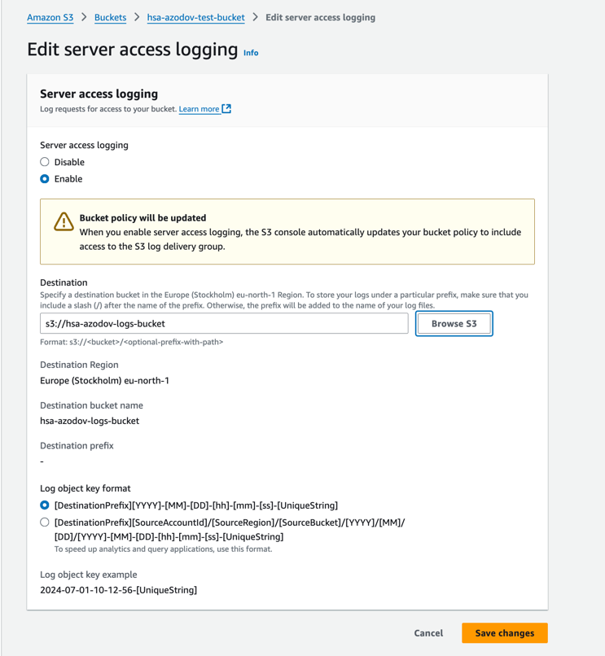
   2. 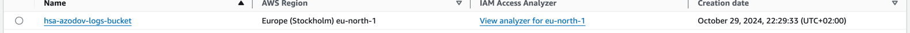
   3. 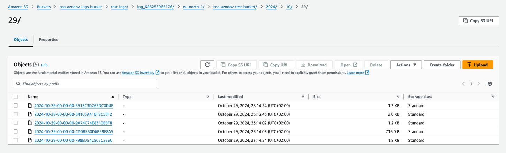
   4. 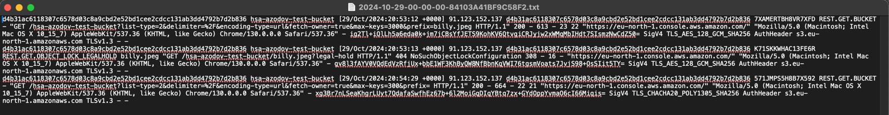